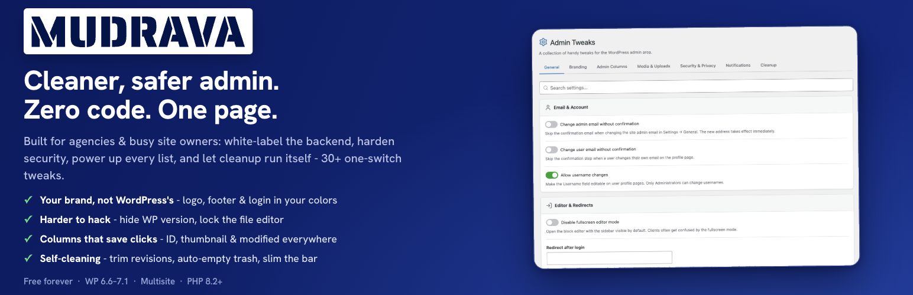

<p align="center">
  <a href="https://wordpress.org/plugins/mudrava-admin-tweaks/">
    
  </a>
</p>

<h1 align="center">MUDRAVA Admin Tweaks</h1>

<p align="center">
  30+ individually toggleable admin-area tweaks for WordPress - branding, list-table columns, media handling, security hardening, notification control and cleanup. One lightweight plugin instead of a dozen micro-plugins.
</p>

<p align="center">
  <a href="https://wordpress.org/plugins/mudrava-admin-tweaks/"></a>
  <a href="https://wordpress.org/plugins/mudrava-admin-tweaks/"></a>
  <a href="https://wordpress.org/plugins/mudrava-admin-tweaks/"></a>
  
  <a href="https://www.php.net/"></a>
  <a href="LICENSE"></a>
  <a href="https://mudrava.com/en/"></a>
</p>

---

## Why MUDRAVA Admin Tweaks?

Small admin fixes usually mean installing another micro-plugin - for one column, one redirect, one logo swap. Ten of those later your site is slow, bloated and full of abandoned code.

**MUDRAVA Admin Tweaks** bundles every one of those little fixes into a single, dependency-free plugin. Each tweak is an independent toggle: switch it on and it registers its hooks, leave it off and the plugin costs you literally nothing.

| Micro-plugin zoo | MUDRAVA Admin Tweaks |
|---|---|
| 10+ plugins, 10+ update streams | 1 plugin, 1 update |
| Unknown, stale codebases | One maintained codebase |
| Duplicated options pages | Single tabbed dashboard |
| Hooks always loaded | Zero overhead when toggled off |

## Features

### General

- **Custom login / logout redirects** - send users anywhere after login or logout
- **Change admin & user email without confirmation** - skip the verify step
- **Allow username changes** - unlock the username field on profile pages (WP 6.7+)
- **Disable fullscreen block editor** - keep Gutenberg out of fullscreen

### Branding

- **Custom footer text & logo** - replace "Thank you for creating with WordPress" with your agency credit
- **Custom admin bar logo** - swap the WordPress logo for your own, with a custom target URL
- **Hide WP logo from admin bar** - or remove the icon entirely
- **"Visit Site" in a new tab**

### Columns

- **ID column** - sortable, on post types *and* the Media Library
- **Featured image column** - thumbnail preview for selected post types
- **Modified date column** - sortable "Last Modified" that matches core styling

### Media

- **Disable big-image scaling** - keep originals above 2560 px untouched
- **Disable year/month folders** - flat uploads directory
- **Randomize upload filenames** - privacy-friendly renaming
- **Rename file to post slug** - automatic, on upload
- **Disable Gravatars** - stop calling external avatar servers

### Security

- **Hide WordPress version** - generator tag, query strings and admin footer
- **Disable file editor** - hard-lock Theme/Plugin file editors
- **Block `/wp-json/wp/v2/users`** - stop username enumeration
- **Remove REST API link header**, **remove X-Pingback**
- **Disable front-end search** - reversible 302 on `?s=`

### Notifications & Cleanup

- Silence Site Health, auto-update, email-verification, new-user and password-change emails
- Limit or disable revisions, tune trash intervals, control RSS feeds
- Strip "Category:" / "Tag:" / "Author:" archive title prefixes
- One-click **force-logout** of all sessions and an AJAX **test email**

## Screenshots

> Screenshots are available on the [WordPress.org plugin page](https://wordpress.org/plugins/mudrava-admin-tweaks/).

**Settings Dashboard** - tabbed UI with live search, toggle switches, AJAX saving.

**Branding** - footer text/logo, admin bar logo replacement, "Visit Site" in a new tab.

**Admin Columns** - Posts list with ID, featured-image thumbnail and Modified columns.

**Media Library** - the ID column added to the Media table.

**Security** - version hiding, file-editor lock, REST user-endpoint block and more.

## Requirements

- WordPress 6.6+
- Tested up to WordPress 7.1
- PHP 8.2+

## Installation

1. Upload the `mudrava-admin-tweaks` folder to `/wp-content/plugins/`.
2. Activate **MUDRAVA Admin Tweaks** on the Plugins screen.
3. Open **Admin Tweaks** in the admin menu.
4. Flip the switches you need and click **Save Changes**.

No theme edits required. Every tweak is off until you enable it.

## Architecture

```
mudrava-admin-tweaks.php   # standalone loader (autoloader, activation hooks, bootstrap)
src/Core/                  # shared core: AbstractModule, AdminUI, Icons, Sanitize
src/Modules/AdminTweaks/   # the module: settings, hooks, view, assets
uninstall.php              # complete option cleanup
tools/build-zip.sh         # wp.org release packaging
```

The plugin is built around a `manifest()` contract in `AbstractModule`, so each tweak group registers its hooks only when its toggle is enabled - disabled tweaks never touch the request lifecycle.

## Development

```bash
# lint every PHP file
find . -name '*.php' -exec php -l {} \;

# build the wp.org-ready release zip
./tools/build-zip.sh
```

## Security & Privacy

- No telemetry, no remote calls, no data ever leaves your site.
- All AJAX endpoints: nonce + `manage_options` capability checks.
- All stored input sanitized (`esc_url_raw`, `wp_kses_post`, allow-lists); all output escaped.
- Sensitive toggles (username edit, force logout) are admin-only and server-side enforced.

## License

GPL-2.0-or-later - see [LICENSE](LICENSE).

## Support

[support@mudrava.com](mailto:support@mudrava.com) · [mudrava.com/en/](https://mudrava.com/en/)
